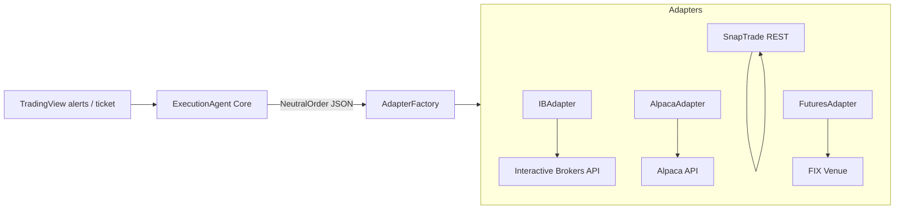

# ExecutionAgent – Broker‑Agnostic Adapter Strategy

## Goal

Create a **broker‑agnostic execution platform** that accepts a single, neutral JSON order schema and routes trades to any supported venue through lightweight *broker adapters*.  This maximises broker reach while preserving a single source of truth for strategy logic and risk management.

## Architecture Overview



## 1  Infrastructure Basics to Leverage

| Layer                     | Off‑the‑Shelf Option                                                        | Notes                                              |
| ------------------------- | --------------------------------------------------------------------------- | -------------------------------------------------- |
| **Cloud runtime / CI**    | AWS (ECS + RDS), GCP (Cloud Run), GitHub Actions                            | Auto‑deploy, secrets manager, IAM.                 |
| **Task / queue**          | Celery or RQ with Redis / RabbitMQ                                          | Runs strategy eval jobs; ensures webhook ≤3 s ACK. |
| **Async HTTP / WS**       | `httpx`, `aiohttp`, `websockets`                                            | Non‑blocking adapter calls.                        |
| **FIX engine (optional)** | QuickFIX‑Python / QuickFIX‑J                                                | For listed futures/FIX venues.                     |
| **Broker SDKs**           | `ib_insync`, `alpaca-py`, `tda-api`, `oandapyV20`, `binance-connector`      | Speeds up adapter mapping.                         |
| **Symbol mapping**        | Nightly cron pulling each broker’s `/symbols` endpoint; cache in Redis/CSV. | Avoids hard‑coded contract IDs.                    |
| **Logging / monitoring**  | ELK stack, Loki + Grafana, Sentry                                           | Required for TradingView audit & SLA.              |

## 2  Reference Contracts to Borrow

| Source platform                 | Interface concept worth mirroring                                       | Why borrow it?                                   |
| ------------------------------- | ----------------------------------------------------------------------- | ------------------------------------------------ |
| **TradingView Broker SDK**      | `placeOrder()`, `cancelOrder()`, `streamOrders()`, unified status enums | Already proven in retail web UX.                 |
| **MultiCharts IOrderExecution** | Separate `Place`, `Change`, `Cancel`, `GetOpenPos`                      | Clean, thin DLL contract; broad broker adoption. |
| **Sierra Chart Service**        | Order‑state enum (New → Pending → Filled/Cxl)                           | Simple state machine easy to map.                |
| **NinjaTrader IProvider**       | Event callbacks (`OnExecution`, `OnPosition`)                           | Async pattern fits Python `async for` yields.    |

### Proposed **AdapterBase** (ExecutionAgent)

```python
class AdapterBase(ABC):
    async def place_order(self, order: NeutralOrder) -> str: ...
    async def cancel_order(self, broker_order_id: str): ...
    async def stream_fills(self) -> AsyncIterator[FillEvent]: ...
    async def get_positions(self) -> list[Position]: ...
    async def get_account_summary(self) -> AccountSummary: ...
```

Core logic never imports broker SDKs directly—only concrete adapters do.

## 3  Adapter Implementation Roadmap

1. **Lock Neutral Schemas**
      `NeutralOrder`, `FillEvent`, `Position`, enum sets.
2. **Build flagship adapters**
      \* `IBAdapter` → Interactive Brokers (rich verbs, high throughput).
      \* `AlpacaAdapter` → REST equity test‑bed (fast MVP).
      \* `SnapTradeAdapter` → fan‑out to IBKR/Tradier/Schwab via one REST.
3. **Add crypto & futures**
      \* `BinanceFutAdapter`, `BybitAdapter` (REST/WS).
      \* `FIXFuturesAdapter` using QuickFIX to reach FCMs on CME/ICE.
4. **Optionals**
      \* DriveWealth/Apex BaaS for fractional equities.
      \* Regional CFD brokers (Saxo, IG) once demand arises.

## 4  Risk & Compliance Considerations

* **Latency budget:** return broker ACK to TradingView plug‑in ≤ 2 s p95.
* **Audit trail:** store raw request/response JSON and order status transitions for ≥ 7 years.
* **Uptime target:** 99.5 % per TradingView SLA (≈ 22 min/week downtime).
* **Security:** encrypt API keys in KMS; use per‑adapter rate‑limit guards.

## 5  Next Steps

1. Finalise neutral schemas and `AdapterBase` interface.
2. Sprint‑0: implement `IBAdapter` + Celery worker; execute full order matrix in paper account.
3. Expose `/tv-webhook` endpoint; test end‑to‑end with TradingView alerts.
4. Prepare design doc for future TradingView Broker plug‑in (Tier 3) once MVP traction is proven.

---

**ExecutionAgent will thus deliver one consistent JSON contract to a growing fleet of adapters—maximising broker reach while letting the core engine stay laser‑focused on strategy logic, risk, and real‑time management.**
